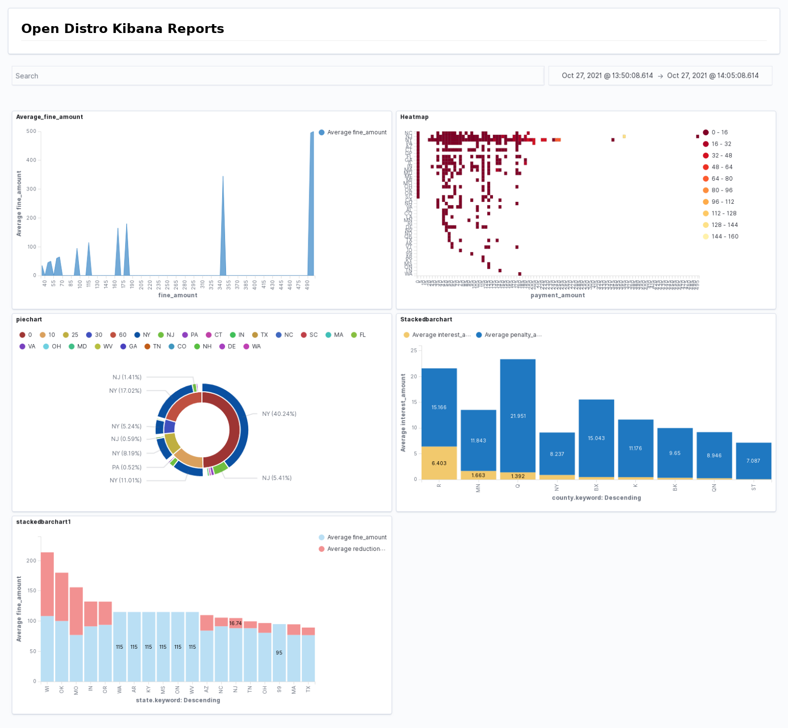
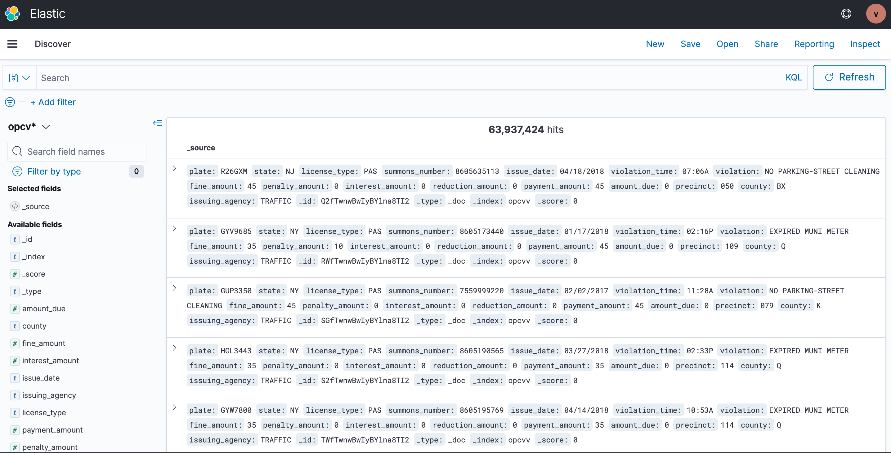
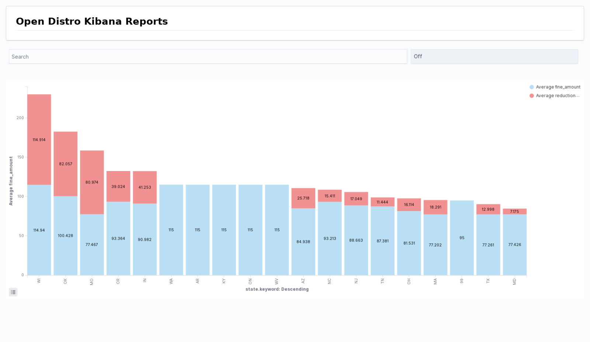
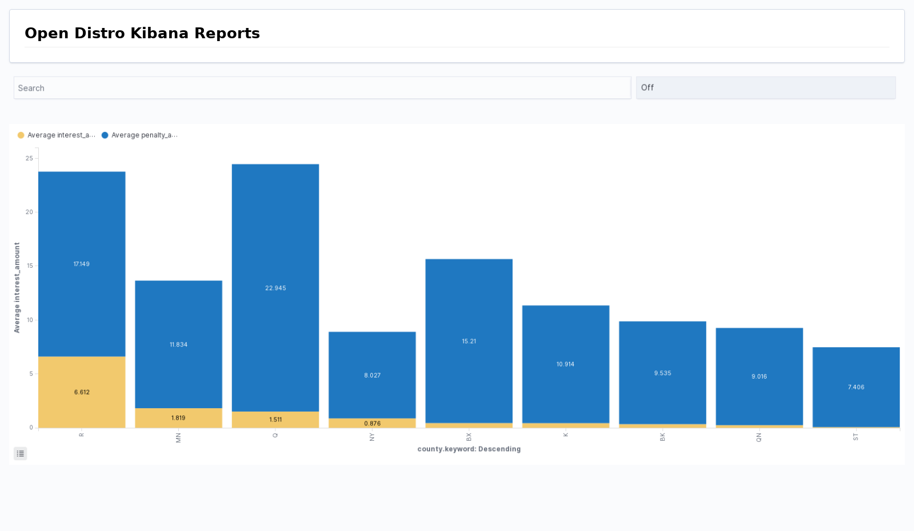
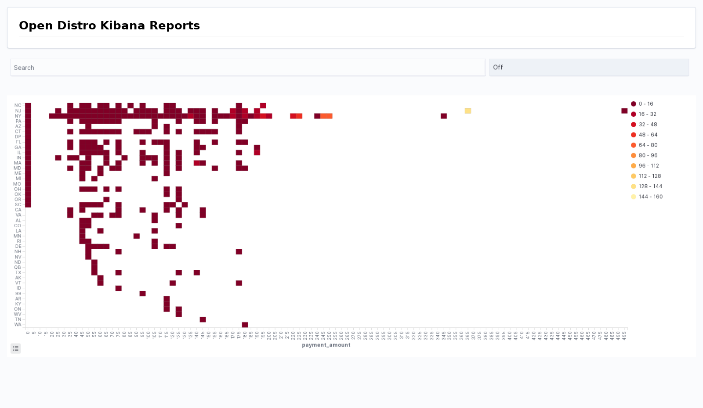
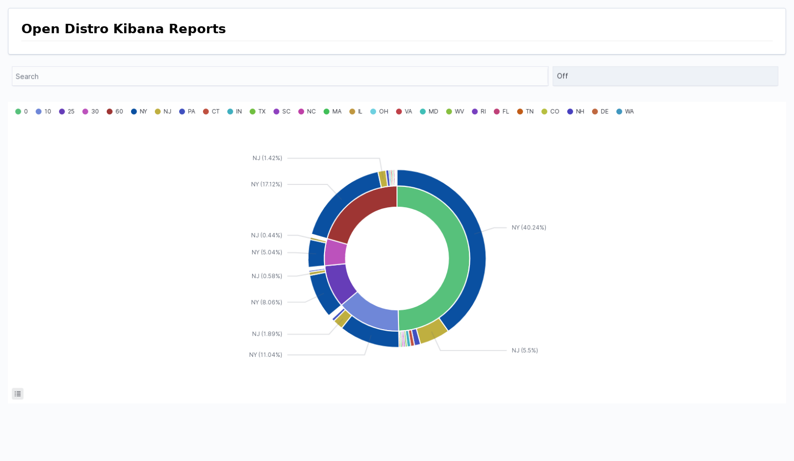

### Vrushank Shah                  ###
### STA 9760 - Big Data Technologies ###
### Project1                       ###

# NYC OPEN DATA ANALYSIS

# Source: 
Link to the dataset: https://data.cityofnewyork.us/City-Government/Open-Parking-and-Camera-Violations/nc67-uf89
Link to Socrata Open Parking and Camera Violations (OPCV) API: https://dev.socrata.com/foundry/data.cityofnewyork.us/nc67-uf89
- [Code for Python](main.py)
- [Code for Docker](Dockerfile)

# Description/Summary:
Each row is a open parking and camera violation issued. Original dataset has over 62 million rows, which are violations issued from 2016. There are 19 columns in the dataset and new and open violations are updated weekly on Sunday. 

In this project, the NYC Open Parking and Camera Violation Dashboard, I applied what I have learned about EC2, Docker, Elasticsearch and Kibana to a real-world dataset powered by NYC Open Data. This dataset has 63.9 million rows and 16 columns. Each row is an open parking and camera violations issued in New York city traced back from 2016 to now. The columns include the violation type, the violation time, the fine amount, and the penalty amount among other violation details.

I wrote a python script that runs in docker to consume data from the Socrata Open Data API and then pushes that information into an Elasticsearch cluster provisioned via AWS. After loading all the data into an Elasticsearch instance, I visualized and analyzed the data with Kibana.
  My dashboard addresses the following topics: 
        - Most popular violations
        - Top 20 states with the highest average fine amount and their average reduction amount
        - The average fine amount, payment amount and interest amount by year

# TechUsed
Docker, Elasticsearch, Kibana, Python, Terminal

# Usage
Step 1: Build the docker image

```console
> docker build -t bigdata1:1.0 project01/
```

Step 2: Run the docker container

```console
> docker run -v ${PWD}:/app -e DATASET_ID=“XXX” -e APP_TOKEN=“XXX” -e ES_HOST=“XXX” -e ES_USERNAME=“XXX” -e ES_PASSWORD=“XXX” bigdata1:1.0 --page_size=1000 --num_pages=1000 
```

with: 
 DATASET_ID: "nc67-uf89" is the ID for this dataset, retrieved from Socrata API link above 
 APP_TOKEN: get this from NYC Open Data (https://data.cityofnewyork.us/profile/edit/developer_settings)
 ES_HOST: get the endpoint link when you create an Elastic Search domain 
 ES_USERNAME: your Elastic Search username
 ES_PASSWORD: your Elastic Search password

# Elasticsearch Dashboard Screenshots
****

# Screenshot of 63.9 million rows generated which shows the max records I was able to achieve at one point in time.



# Analysis of average fine amount by state.



# Analysis of avergae interest amount by state.



# Analysis of correlation between payment amout and states based on Heatmap.



# Analyis of proportion of payment amount by states on Piechart
.



